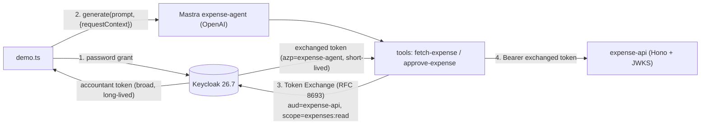

# agent-token-exchange-demo

A runnable demo of **scoping down an AI agent's authority with OAuth 2.0 Token
Exchange (RFC 8693)**.

The point in three lines:

- An accountant hands an agent a request. The naive move is to pass the
  accountant's broad token straight through.
- Instead, the agent **exchanges** that token for one narrowed to
  `aud=expense-api` and `scope=expenses:read`.
- Now even if prompt injection makes the agent try to approve and pay, that
  write is rejected by the downstream API with **403 `insufficient_scope`**.
  You trust the _token_, not the agent.

## Architecture



The cage is enforced **twice**: the `expense-agent` client in Keycloak can only
ever be granted `expenses:read`, and the downstream API independently checks
`aud` + `scope` on every request.

Note that asking for more does **not** raise an error. Requesting
`scope=expenses:approve` on the exchange returns HTTP 200 with a token silently
narrowed back to `scope=expenses:read` (verified on Keycloak 26.7.0) — the cage
holds, but it holds quietly. Callers should check the `scope` in the response
rather than assume a rejection, or reject such requests explicitly with a Client
Policy.

This request uses only a `subject_token`, so it has RFC 8693 impersonation
semantics rather than delegation semantics. Keycloak records the client that
requested the exchange as `azp=expense-agent`; this demo does not use an
`actor_token` or an `act` claim.

## Prerequisites

- Docker + Docker Compose
- Node.js 20.12+ (the demo scripts load `.env` via Node's `--env-file-if-exists`)
- An **OpenAI API key** — only for the LLM-driven `npm run demo`. The token-cage
  mechanics can be run without a key via `npm run demo:no-llm` (this demo is
  fixed to OpenAI via `@ai-sdk/openai`).
- `jq` (only for the optional `scripts/show-tokens.sh`)

## Quick start

```bash
# 1. Keycloak 26.7 (realm auto-imported: clients, scopes, user, mappers)
docker compose up -d

# 2. Downstream API (Hono + JWKS) on :8787
cd api && npm ci && npm run dev

# 3. Agent demo — in another terminal
cd agent && npm ci
cp .env.example .env      # then set OPENAI_API_KEY
npm run demo

# ...or, without any OpenAI key (invokes the tools directly):
npm run demo:no-llm
```

`npm run demo` obtains the accountant's broad token, then runs two scenarios
through the OpenAI-backed agent and prints the before/after tokens.
`npm run demo:no-llm` runs the same two scenarios by calling the tools directly —
identical token-cage behaviour (before/after JWT, 200/403), just without the
model deciding which tool to call.

## What to look for

1. **Before vs. after tokens.** `docker compose up`, then `bash scripts/show-tokens.sh`
   (or read the `demo` output). The exchanged token has `aud` narrowed to
   `expense-api`, `scope` narrowed to `expenses:read`, a shorter lifetime (300s vs
   900s), and `azp=expense-agent` — while `sub` stays `accountant-123`. The
   **before** token is addressed to the agent
   (`aud=expense-agent`): Keycloak only exchanges a subject token that names the
   requesting client in its `aud`.
2. **Scenario 1 — "approval status of EXP-2517?"** → `fetch-expense` runs with the
   caged token → API **200**.
3. **Scenario 2 — "approve EXP-2517 and pay it out"** (injection-style) → the
   agent _tries_ `approve-expense`, but the caged token lacks `expenses:approve`
   → API **403 `insufficient_scope`**. It fails at the token boundary, not
   because the model declined.

The agent's reply is natural language, so each tool also prints the raw HTTP
status right before it — both scenarios stay readable in a single terminal:

```
[agent] GET /expenses/EXP-2517 → HTTP 200
agent replies: Expense report EXP-2517 is currently **Pending approval (1 of 2 approvers signed off)**.

[agent] POST /expenses/EXP-2517/approve → HTTP 403 {"error":"insufficient_scope","required":"expenses:approve","granted":["expenses:read"]}
agent replies: Couldn’t approve EXP-2517. The backend returned HTTP 403: `insufficient_scope` — required `expenses:approve`, but the granted scope is only `expenses:read`.
```

The API terminal logs the same two calls from the server side (`[api] … -> 200` /
`-> 403`) if you want to watch the verification happen there too.

## How it works

**Token Exchange request** (`agent/src/lib/token-exchange.ts`):

```bash
curl -X POST http://localhost:8080/realms/agents-demo/protocol/openid-connect/token \
  -u expense-agent:expense-agent-secret \
  -d grant_type=urn:ietf:params:oauth:grant-type:token-exchange \
  -d subject_token="$ACCOUNTANT_TOKEN" \
  -d subject_token_type=urn:ietf:params:oauth:token-type:access_token \
  -d requested_token_type=urn:ietf:params:oauth:token-type:access_token \
  -d audience=expense-api \
  -d scope=expenses:read
```

**Keeping the token out of the LLM.** A token in the prompt is a token an
injection can exfiltrate. The accountant token rides in Mastra's `RequestContext`
and is read inside the tool — never placed in the model's context:

```ts
// agent/src/tools/fetch-expense.ts
execute: async (inputData, context) => {
  const subjectToken = context?.requestContext?.get("subjectToken") as string;
  const token = await exchangeToken(subjectToken, {
    audience: "expense-api",
    scope: "expenses:read",
  });
  // ... call the API with the narrowed token
};
```

**Downstream verification** (`api/src/index.ts`): fetch the JWKS from Keycloak,
verify the signature, check `iss` and `aud=expense-api`, then require the route's
scope (`expenses:read` for reads, `expenses:approve` for approvals). Successful
requests and authenticated `insufficient_scope` failures log `sub` and `azp`
for audit correlation.

## Notes

- **Not for production.** Secrets are committed in `realm.json` / `.env.example`,
  TLS is disabled, and passwords are trivial — all for a one-command demo.
- License: MIT.
